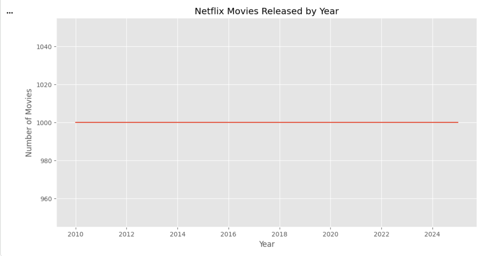
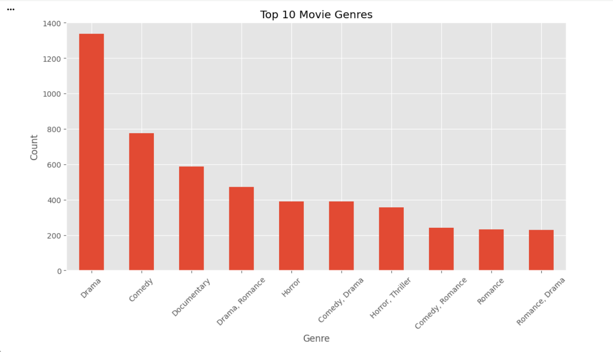
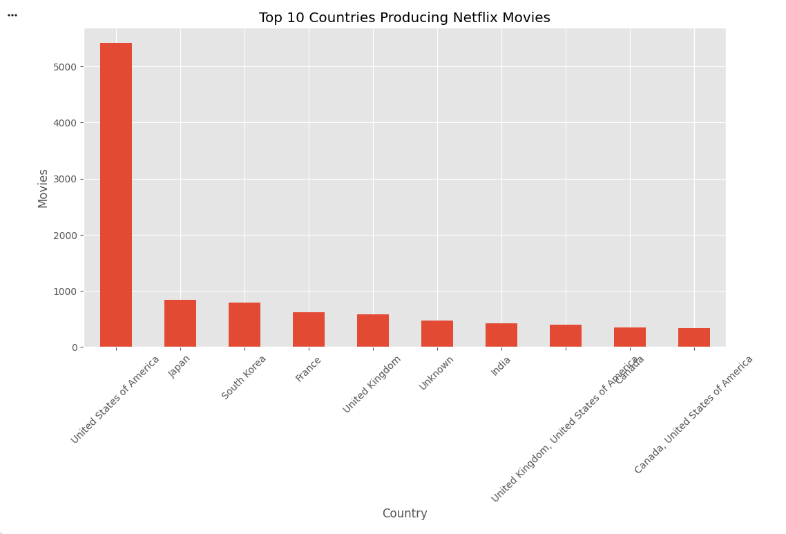
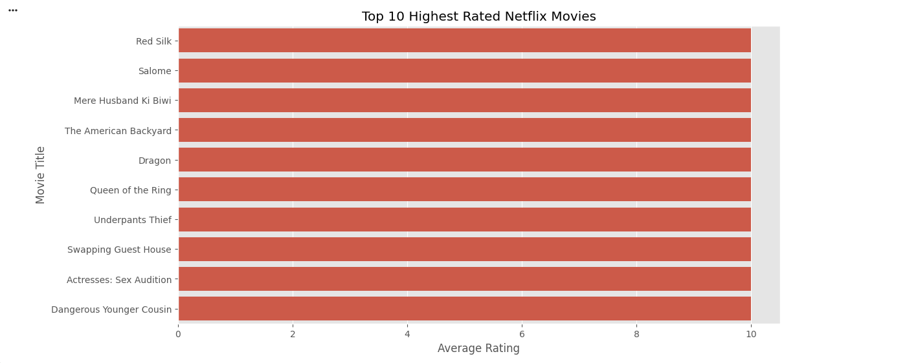
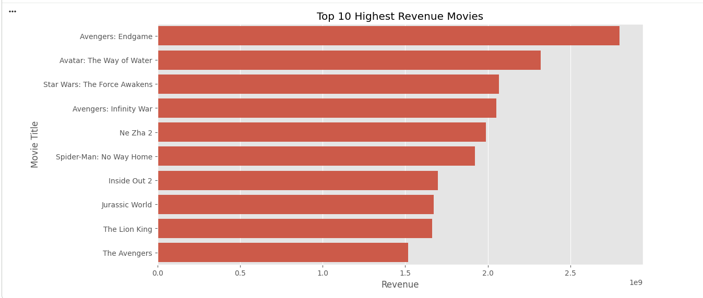
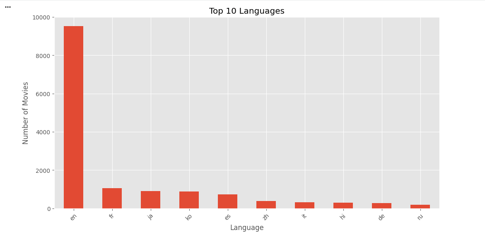
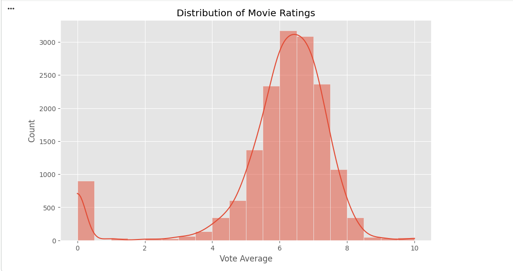
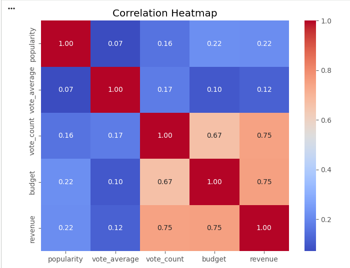
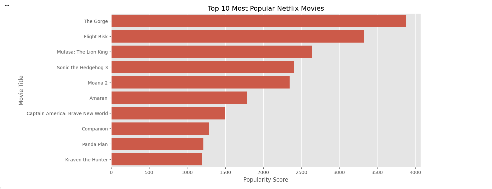
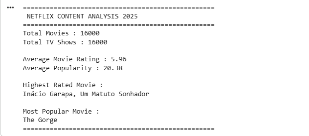

# 📺 Netflix Content Analysis 2025 Using Python

## 📌 Project Overview

This project explores Netflix Movies and TV Shows data using Python to identify trends, analyze content characteristics, and generate meaningful business insights through Exploratory Data Analysis (EDA).

The dataset used for this project contains Netflix content information updated up to **2025**.

---

## 🎯 Objectives

* Analyze Netflix content trends
* Explore movie genres and languages
* Identify top producing countries
* Discover the highest-rated and most popular movies
* Visualize insights using Python

---

## 🛠️ Technologies Used

* Python
* Pandas
* NumPy
* Matplotlib
* Seaborn
* Google Colab

---

## 📊 Project Workflow

1. Data Loading
2. Data Cleaning
3. Missing Value Analysis
4. Exploratory Data Analysis (EDA)
5. Data Visualization
6. Business Insight Generation

---
## 📈 Project Visualizations

### 📅 Netflix Movies Released by Year

---

### 🎭 Top 10 Movie Genres

---

### 🌍 Top 10 Producing Countries

---

### ⭐ Top 10 Highest Rated Movies

---

### 🔥 Top 10 Most Popular Movies

---

### 🗣️ Top Languages

---

### 📊 Rating Distribution

---

### 📈 Correlation Heatmap

---

### 💰 Top Revenue Movies

---

### 📋 Final Summary

---

## 📂 Dataset

Netflix Movies and TV Shows Dataset (Updated to 2025)

---

## 🚀 Project Outcome

This project demonstrates practical skills in:

* Data Cleaning
* Exploratory Data Analysis (EDA)
* Python Programming
* Data Visualization
* Business Insight Generation

---

## 👩‍💻 Author

Adini Uththara
Information Systems Engineering Undergraduate
